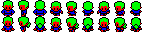

# 13 Steps to escape - 2024 JS13K Post mortem

## Introduction

For this 13th special anniversary, I wanted to make a 2D pixel art game.  
In 2015, my first entry was a 2D pixel art game, and I wanted to check how my skills had improved over the last 9 years!  
You can check it out here: [Super Peach World](https://js13kgames.com/2015/games/super-peach-world)  
The parallax was fine, but there were artifacts due to my asset management, and the PNG tileset took up a large portion of the project.

For this year, I was immediately inspired by the triskaidekaphobia theme: a "curse" that creates a loop of 13 seconds or 13 steps.  
My first inspiration was _Minit_ — I wanted to create a 2-color game to save space with asset sizes, and the 1-minute loop could certainly be adapted to a 13-second loop.  
But... no. 13 seconds was really too short to achieve something meaningful, and 13 steps didn't fit a story-driven game like _Minit_.  
Then, I thought about one of my favorite games of this year: _Isles of Seas and Sky_, a beautiful and innovative puzzle game!  
I imagined a game mixing both: puzzles with 13 steps and the ability to change the spawn point.

## Tiles / Image management

I initially wanted a 2-color game, which then became a 5-color game, with a twist I’ll explain later.  
I recreated assets similar to _Isles of Seas and Sky_ as they were beautiful pieces of art, using 16x16 tiles.  
To save bytes, I only used white, black, red, green, and blue colors.  
At first, I used a tileset with all images to save space, and since I only had 5 colors, it was well optimized.  
However, after several tests — even if I exported a web-optimized PNG, reduced it using TinyPNG, then exported it to WebP — it was still a bit heavy.  
So, I tried a Run-Length Encoding (RLE) approach. I created a node script to export my images as strings. Every color had its own characters. For example, "a" means 1 white, "b" for 2 whites, "d" for 4... Each color has its own set of "charAt()" functions which allows me to know which color and how many consecutive pixels of that color are drawn.

This approach was heavier than WebP, but once zipped, since text compresses better, it ended up being lighter!  
It was also more readable, as I could easily build a pixel array of 16x16 using indices from 0 to 4 for the colors used.




### Tiles animation

If a tile as more than 16x width, I make an animation between images, like I've done for the flag or spawn points


## Colors

For every tile, I had a 16x16 array for every pixel, using 5 indices:

- 0 for white, which I replaced with transparency
- 1 for black, mostly used for borders/main shapes
- 2, 3, 4 for red, blue, green (these colors took fewer bytes when I exported the PNG, so I continued using them for generation)

Then, I created "color sets," which are arrays allowing me to replace any color with another.  
Using these sets of colors, I saved space by reusing colors for several items and maintaining consistency in the art.

Later on, I also used arrays of color sets to define some tiles, allowing me to change the colors of items like the gong and switches.

With this system, I soon implemented character customization, as I could easily change any tile's color using this approach.

```js
const COLOR_SETS = {
  blueGreen: ['#024d53', '#599dbc', '#72d1c7', '#a9ffe6'],
  bronze: ['#011721', '#811c07', '#ca6137', '#ffb59c'],
  silver: ['#011721', '#014a5d', '#7ddbff', '#d0ffea'],
  gold: ['#011721', '#5e3718', '#d8aa3b', '#fdffaa'],
};
```

```js
const COLOR_SETS = {
  blueGreen: ['#024d53', '#599dbc', '#72d1c7', '#a9ffe6'],
  bronze: ['#011721', '#811c07', '#ca6137', '#ffb59c'],
  silver: ['#011721', '#014a5d', '#7ddbff', '#d0ffea'],
  gold: ['#011721', '#5e3718', '#d8aa3b', '#fdffaa'],
};
```

Tils got many parameters

```js
const TILE_DATA = {
  arrow: {
    rle: '16LKZLA\\K^LZLBZLBZLLLLLLLLLLLLG',
    colors: COLOR_SETS.blueGreen,
    limit: 0,
    isStatic: true,
    canChangeOrientation: true,
    useOrientationForColor: true,
    colors: [COLOR_SETS.bronze, COLOR_SETS.silver, COLOR_SETS.gold, COLOR_SETS.purple],
  },
};
```

- **rle** is the image encoded string
- **colors** to know which set of colors is used for the tile
- **limit** is used on editor. 0 is not shown, and 1 is for single use items (like flag and start spawn point)
- **isStatic** for a bit of optimization, static elements which never move (walls, spikes, holes...) are drawn once and saved with background image. I didn't want to redrawn everything at every frame
- **canChangeOrientation** if the orientation can be changed (for blocks)
- **useOrientationForColor** to allow a tile to get multiple colors sets instead of orientation (for switches, gongs...) if true, colors parameter is an array of 4 sets

## Level structure

Initially, I used a JSON object to manage my levels. It was a huge array with the x, y, and tile information for each location.  
It worked but was hard to manage, a bit heavy, and not easy to visualize.  
I wanted to use a tool to manage level editing and mapping, but I wasn't satisfied. So, I decided to create my own level editor.  
It wasn’t difficult once I had the grid in place — I just had to manage tile placement with mouse events and use `console.log` to export the JSON for testing.

Then, I got the idea to use a system similar to RLE. This time, it was a bit different from how I handled images: each tile was associated with a letter followed by a number representing how many consecutive tiles of that type appeared. Since my level size was fixed at 20x10 with borders, I had a maximum string length of 144 for a level.  
I also added special characters to define orientation (or color set to use).

To decode this, I used a simple regex:

```
/([A-Z\-])([xyz]?)(\d*)/g;
```

- I used A to Z for the tile type ("-" was used for empty tiles).
- `x`, `y`, or `z` defined orientation/color set (up by default, needing only three letters for left, right, or bottom).
- The number indicated the amount (optional, with nothing meaning just one tile).

This system allowed me to share custom levels just by using a URL parameter (which made testing really easy). I would copy the parameter string into my code once the level was finalized.

## Level design

At first, I wanted to reuse levels from _Isles of Seas and Sky_ to save time, but none were well-suited for a 13-step loop.  
Crates are tricky since it's a "2-step action" (push, then move), and repeating this process with a respawn wasn't fun.  
I had to create custom levels for my game.

Onboarding was complex since I didn’t want to add explicit tutorials; I wanted the game to be intuitive and self-explanatory.

- In the first level, I added arrows indicating that you had to push crates, then trigger the gong. Once this was done, you had access to the key, and you could push the arrowed block only in the indicated direction.
- In the second level, I introduced how respawning can be used, as you’re locked behind holes after triggering the gong. I also showed how crates can fill holes.
- The third level added a second spawn point and required players to unlock paths to access the next area. This one gave players exactly 13 steps to push the crate after unlocking the path, then respawn in the correct location to push it into the hole.

These first three levels served as an introduction and were not particularly challenging.

- The fourth level was a bit harder, requiring players to use the respawn feature strategically to avoid traps. Some players found it confusing, but I didn’t think it was overly difficult.
- The fifth level introduced spikes and a switch, but some players discovered a shortcut using the first crate. To fix this, I locked the crate and added spikes near it to encourage players to push it onto the spikes. However, it took some time for players to realize that crates could be pushed onto spikes. The spike tile art, inspired by _Isles of Seas and Sky_, didn’t work as well since many players didn’t understand what it represented.
- The sixth level was one of the first intermediates I designed. I wanted to use traps to allow access to certain areas only once. It wasn’t too difficult but required players to complete tasks in the correct order. It needed to be placed after level 5 because the switch mechanic wasn’t well-introduced there.

- Level 7 was one of the hardest, introducing boulders. The second part required players to respawn multiple times, which wasn’t the best gameplay mechanic, but the solution of placing a boulder in front of a respawn point was fun to design. I thought locking the key behind the crate was clever, but I later noticed an alternative solution if the crate was placed on the switch.
- Level 8 introduced the final feature: destroying crates when placed on a raised switch block. It was the hardest level and a blast to design!

## Game mechanics

Since the game operates on a step-by-step basis rather than free movement, collision detection was easy to manage.  
I had two main algorithms to manage actions: before moving and after moving.

- Before moving, I checked if the player could move, if they were pushing a crate or boulder, activating a gong, deactivating a switch, etc.
- After moving, I checked if the player had left a trap, triggered a switch, picked up a key, etc.

I’m proud of how I designed multiple mechanisms, and it was quite easy with this system.  
The most complicated parts were crates and boulders since they could move themselves and activate switches, fill holes, or trigger gongs.

Since I used tile orientation to check if the player was pushing the correct way, I used the same variable to ensure tiles only activated when aligned with the same color.

## Undo feature

The undo feature was easy to code, but initially, I undid the previous action instead of moving step by step.  
This was a bit confusing, so I changed it to step by step, which requires more key presses but feels better since movement is limited.  
How does it work? I used the level encoding feature after every step, saving all tiles and the level state as a short string. Additional parameters like player spawn, orientation, and number of keys picked up were also stored.  
When undoing, I simply redraw the level and reset those few values, which is both performant and space-efficient!

## Music and SFX

I first used ZZFX to create the sound effects, which were pretty cool, but I couldn’t create any music with it.  
I found the tool too complex to learn. So, I switched to Soundbox, which offered better music with more "reverb" and smoother sounds, but I preferred the SFX I had with ZZFX for most of the sound effects.

The music was inspired by the intro of Sia's song "Breathe Me" (though it’s heavily modified, I’m not sure if anyone would recognize it!).  
It’s a song I love and it perfectly fit the chill mood of the game.

In fact, there are two tracks: one with drums and one without.  
To save space, I combined both in the code by just "adding" the drums to the second track. I play the first track (without drums) first, then once it ends, I loop the second one with the drums.  
I’m proud of this trick as it enhances the game's vibe, evolving from a calm mood to a more present and active sound over time.

## Level selection

For the level selection, I just draw a preview of each level using their encoded string, then save it in memory to avoid redrawing each frame.  
It’s not really optimized, but at first, I was redrawing every pixel of every level for each frame, which caused a significant FPS drop!

## UI and text

I reused a font from my first entry but optimized it significantly.  
In my original version, every letter was an array for each pixel, but I replaced it with a single string of 0s and 1s.  
All letters have the same height, and although their widths vary, a `mod 5` operation allows me to draw pixels correctly.

I can draw text or tiles anywhere.  
Tiles are drawn on the 20x10 screen, so when I display a star after a level is completed, or keys in the UI, I just use floating numbers to place them exactly where I want.

I also have a "zoomFactor" variable.  
Since the grid is 20x10 with 16x16px tiles, the game operates within a 320x160 pixel zone.  
When the screen resolution allows after resizing, I apply a zoom factor to make the canvas fit the screen, and every element drawn (text or tile) is scaled accordingly, avoiding subpixels rounded.

## Input Handling & Gamepad Support

One of the challenges I faced during development was managing player inputs from both the keyboard and gamepad. I implemented a unified system to handle actions from either input method smoothly. Each input, whether from the keyboard or gamepad, is mapped to a specific action (`up`, `down`, `left`, `right`, `action`, etc.). To avoid repeated actions when a key or button is held down, I set up a key stack system: when the player presses a key or button, the corresponding action is added to the stack and remains active until the key is released. At that point, the action is removed from the stack, ensuring precise control and preventing unintended repeated actions every frame.

For **gamepad support**, I used the Web Gamepad API to detect button presses and releases. To optimize this, I implemented a button state array that tracks which buttons are currently pressed. Each button is mapped to a specific action (e.g., the A button for the main action, the D-Pad for movement). This setup allows me to avoid triggering actions on every frame, reacting only when the button state changes (pressed or released). This unified input handling system made the gameplay feel smoother and more intuitive, regardless of whether the player used a keyboard or a gamepad.
